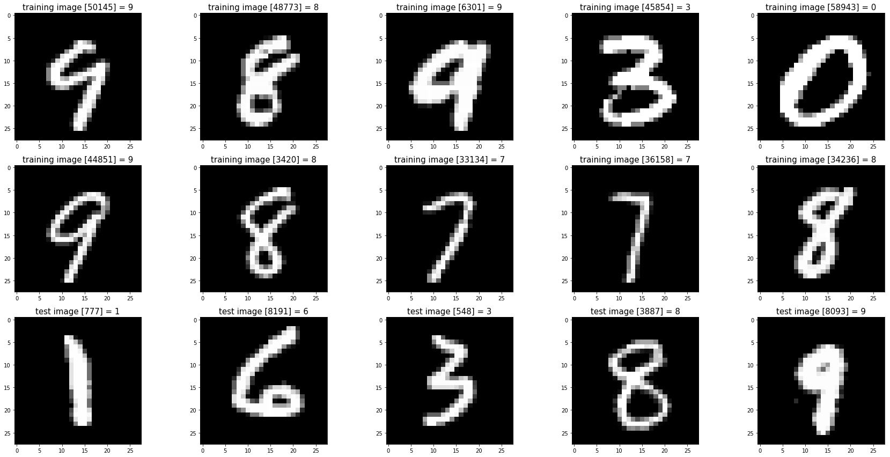

# PROYECTO JAKUNAKA : RED NEURONAL DE PARA DETECTAR DIGITOS ESCRITOS A MANO (BASANDOSE EN MINST DATABASE)

  

jakunaka es una red neuronal con Tensorflow y Keras en Python para clasificar dígitos escritos a mano. Basado de [MINST DATABASE](https://yann.lecun.com/exdb/mnist/)

## CONTENIDO
* jakunaka_reader.py : script que lee los archivos

  ** train-images.idx3-ubyte
  ** train-labels.idx1-ubyte
  ** t10k-images.idx1-ubyte
  ** t10k-labels.idx1-ubyte

  y luego convierte los bytes en pixeles para luego elegir aleatoriamente de 0 a 9 digitos como imagen asi como el label y graficarlos con matplotlib.

* jakunaka.py : script de red neuronal Tensorflow y Keras que identifica una imagen como digito .

## REQUISITOS
* importar las librerias tensorflow,matplotlib con pip install

## AGRADECIMIENTOS
* gracias a video de Andreas Zinonos https://www.youtube.com/watch?v=BfCPxoYCgo0
* gracuas a video de Pepe Cantoral https://www.youtube.com/watch?v=W5HJKWL2i08
